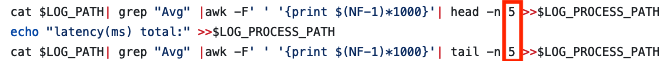
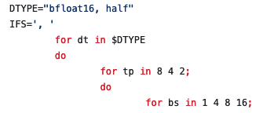

# MI308X vllm_poc

## 1. Start an environment

#### Docker image:rocm/pytorch-private:20240828_exec_dashboard_unified_v7_vllm0.5.5_rccl6.2.0_moe_final_v0.5.5

```bash
sudo docker run -it --network=host --shm-size 16g -v /home/:/work -v /data/models:/data --env HF_HOME=/data --env TOKENIZERS_PARALLELISM=false --device=/dev/kfd --device=/dev/dri --group-add video --cap-add=SYS_PTRACE --security-opt seccomp=unconfined --ipc=host -d --name vllm_poc rocm/pytorch-private:20240828_exec_dashboard_unified_v7_vllm0.5.5_rccl6.2.0_moe_final_v0.5.5
```

## 2. Offline Latency Benchmark

### Command to start test

```bash
cd Inference/offline/latency
bash latency_sweep.sh
```
### Modify input_len
run_vllm.sh:

 

latency_sweep.sh:

 

### Modify params

latency_sweep.sh:

 

### Profile

```bash
Profle:
bash run_vllm 1

non-Profile:
bash run_vllm 0
```

latency_sweep.sh:

 


## 3. Offline Throughput Benchmark

```bash
cd Inference/offline/throughput
bash run.sh
```
